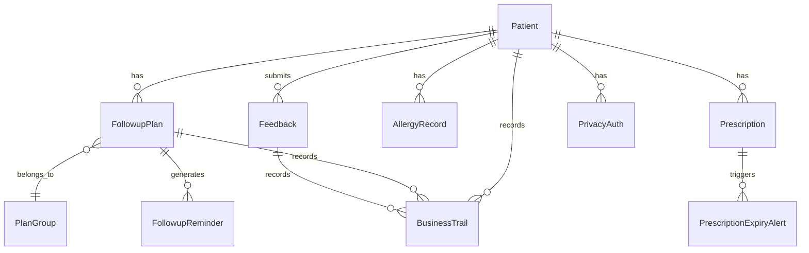

## 1. 架构设计

```mermaid
graph TB
    subgraph "前端层"
        "React 18 页面组件" --> "Zustand 状态管理"
        "Zustand 状态管理" --> "业务规则引擎"
        "业务规则引擎" --> "Mock 数据层"
    end
    subgraph "页面模块"
        "工作台" --> "Zustand Store"
        "随访计划" --> "Zustand Store"
        "患者管理" --> "Zustand Store"
        "逾期督办" --> "Zustand Store"
        "业务轨迹" --> "Zustand Store"
    end
```

纯前端应用，无后端服务。所有数据通过 Zustand Store 管理，业务规则在前端计算执行。

## 2. 技术说明

- 前端：React@18 + TypeScript + Tailwind CSS@3 + Vite
- 状态管理：Zustand@5（单 Store 架构，分 slice 管理）
- 路由：react-router-dom@7
- 图标：lucide-react
- 工具：clsx + tailwind-merge
- 数据：Mock 数据内置，无外部数据库

## 3. 路由定义

| 路由 | 用途 |
|------|------|
| / | 工作台仪表盘 |
| /plans | 随访计划管理 |
| /patients | 患者管理列表 |
| /patients/:id | 患者详情（抽屉覆盖层） |
| /overdue | 逾期督办 |
| /trail | 业务轨迹 |

## 4. 数据模型

### 4.1 数据模型定义



### 4.2 核心类型定义

**Patient（患者）**
- id, name, age, gender, phone
- chronicDisease: 慢病类型（糖尿病/高血压/冠心病/慢阻肺/哮喘）
- riskLevel: 风险等级（normal/attention/critical）
- status: 状态（active/paused/stopped/archived）
- groupId: 分组ID
- consecutiveMissedFeedback: 连续未反馈次数
- privacyAuthorized: 是否授权隐私
- stoppedAt: 停药日期
- archivedAt: 归档日期

**FollowupPlan（随访计划）**
- id, patientId, groupId
- cycleDays: 随访周期（天）
- nextFollowupDate: 下次随访日期
- prescriptionExpiryDate: 处方有效期
- status: 状态（active/completed/expired/suspended）
- createdAt, updatedAt

**Feedback（用药反馈）**
- id, patientId, planId
- efficacyRating: 疗效评分（1-5）
- adverseReaction: 不良反应描述
- compliance: 依从性（good/moderate/poor）
- submittedBy: 提交者角色（pharmacist/patient）
- submittedAt

**AllergyRecord（过敏禁忌）**
- id, patientId, drugName, severity, note

**Prescription（处方）**
- id, patientId, drugName, dosage, frequency
- prescribedDate, expiryDate
- status: 状态（valid/expired/renewed）

**PlanGroup（分组）**
- id, name, diseaseType, riskLevel

**BusinessTrail（业务轨迹）**
- id, patientId, type（plan_created/feedback_changed/overdue_escalated/prescription_expired/medication_stopped）
- description, operator, operatorRole, timestamp

**OverdueRecord（逾期记录）**
- id, patientId, planId, overdueDays, supervisionStatus
- supervisor, supervisedAt

## 5. 业务规则引擎

所有业务规则在前端 Zustand Store 的 action 中实现：

1. **连续两次未反馈升级**：feedback 提交时检查 consecutiveMissedFeedback >= 2 → riskLevel 升级为 critical → 记录轨迹
2. **处方过期拦截**：随访计划生成/提醒触发时检查 prescriptionExpiryDate < today → 拦截 + 生成复诊建议 → 记录轨迹
3. **停药停止提醒**：患者 status=stopped 时 → 随访计划状态改为 suspended → 后续不生成提醒 → 记录轨迹
4. **过敏禁忌检查**：处方药品与过敏记录匹配时 → 拦截并提示 → 不允许关联
5. **隐私授权检查**：隐私未授权时 → 不允许发送提醒通知 → 仅允许店内记录

## 6. 目录结构

```
src/
  components/
    Layout/           # 侧边栏、顶栏、布局容器
    Dashboard/        # 工作台组件
    Plans/            # 随访计划组件
    Patients/         # 患者管理组件
    Overdue/          # 逾期督办组件
    Trail/            # 业务轨迹组件
    shared/           # 共享组件（Modal、Drawer、Badge等）
  hooks/
    useStore.ts       # Zustand Store
    useTheme.ts       # 主题切换
  lib/
    utils.ts          # 工具函数
    mockData.ts       # 样例数据
    rules.ts          # 业务规则引擎
  pages/
    Dashboard.tsx     # 工作台
    Plans.tsx         # 随访计划
    Patients.tsx      # 患者管理
    Overdue.tsx       # 逾期督办
    Trail.tsx         # 业务轨迹
  types/
    index.ts          # 类型定义
  App.tsx
  main.tsx
  index.css
```
